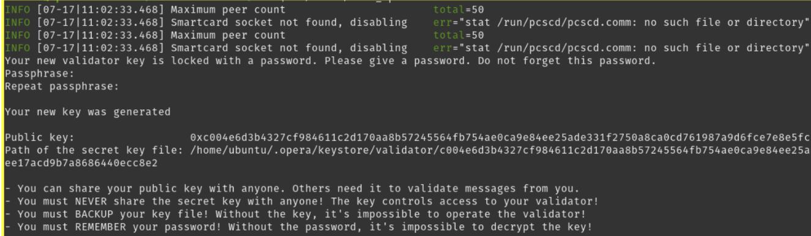

# AssetChain Blockchain

This repository contains all resources required to set up a validator node in the AssetChain Blockchain.

## Table of Contents
- [Requirements](#requirements)
- [Getting Started](#getting-started)
- [Contributing](#contributing)
- [License](#license)
- [Support](#support)

## Requirements

The requirements for running a validator node are shown below:

1. **Minimum Stake**: 200,000 RWA
2. **Maximum Validator Size**: 15x the self-stake amount
3. **Minimum Hardware Requirements**: AWS EC2 m5.xlarge with 4 vCPUs (3.1 GHz) and at least 1 TB of Amazon EBS General Purpose SSD (gp2) storage (or equivalent).
4. **Recommended Specifications**: For better performance, consider using AWS m6i.2xlarge, c6i.4xlarge, or bare metal with equivalent or higher specs.
5. **Rewards**: Currently ~6% APY (Normal APY on self-stake + 15% of delegators' rewards). APY varies based on staked percentage.

## Getting Started

To get started, follow the steps below:

1. **Launch Cloud Instance**:
   - You can either run a node on your own hardware or use a cloud provider. We recommend using one of the major cloud providers, such as Amazon AWS.
   - We recommend using Ubuntu Server 22.04 LTS (64-bit).

2. **Network Settings**:
   - Open up port 22 or any other port of preference for SSH.
   - Open up port 5050 for both TCP and UDP traffic. Alternatively, use the `--port <port>` flag to specify a custom port when running your node.

3. **Set up a Non-Root User**:
   - SSH into your machine:
     ```bash
     ssh root@{VALIDATOR_IP_ADDRESS}
     ```
   - Update the system:
     ```bash
     sudo apt-get update && sudo apt-get upgrade -y
     ```
   - Create a non-root user:
     ```bash
     USER={USERNAME}
     sudo mkdir -p /home/$USER/.ssh
     sudo touch /home/$USER/.ssh/authorized_keys
     sudo useradd -d /home/$USER $USER
     sudo usermod -aG sudo $USER
     sudo chown -R $USER:$USER /home/$USER/
     sudo chmod 700 /home/$USER/.ssh
     sudo chmod 644 /home/$USER/.ssh/authorized_keys
     ```
   - Add your SSH public key to the new user's `authorized_keys` file.

4. **Install Required Tools**:
   - Install build tools:
     ```bash
     sudo apt install apt-transport-https libc-bin gcc git musl ca-certificates curl zsh make unzip build-essential gawk wget bison flex
     ```
   - Install Go:
     ```bash
     wget https://go.dev/dl/go1.22.0.linux-amd64.tar.gz
     sudo tar -xvf go1.22.0.linux-amd64.tar.gz
     sudo mv go /usr/local
     export GOROOT=/usr/local/go
     export GOPATH=$HOME/go
     export PATH=$GOPATH/bin:$GOROOT/bin:$PATH
     source ~/.profile
     exec bash
     ```

5. **Install and Set Up Opera**:
   - Clone the Opera repository and build:
     ```bash
     git clone https://github.com/xendfinance/assetchain-blockchain
     cd assetchain-blockchain/
     go clean -modcache
     go mod tidy
     export GOPROXY="https://proxy.golang.org"
     mkdir -pv build
     go build -v -o build/opera ./cmd/opera
     ```

6. **Start Opera Node**:
   - Download the genesis file and start the node:
     ```bash
     curl https://asset-testnet.assetchain.org/genesis_new.g --output genesis.g
     cd build/
     nohup ./opera --port 3000 --nat any --genesis.allowExperimental --genesis ../genesis.g --http --http.addr="0.0.0.0" --http.port=4000 --http.corsdomain=* --http.vhosts=* --http.api=eth,debug,net,admin,web3,personal,txpool,ftm,dag --bootnodes="enode://27c5f90bd11d2e5df3901c8f893cfcbe0e62c0edfda88170eff43a87eb54c333a1ddce3dc6765eeeccfd37f01e614373e2d0449512735e4a96f528ea53e87ddf@34.147.162.187:3000" > opera.log &
     ```

7. **Create and Fund Validator Wallet**:
   - Create a validator wallet:
     ```bash
     ./opera account new
     ```
   - Fund the wallet with at least 200,000 RWA.

8. **Create a new validator key**:
    - Create a validator key:
     ```bash
     ./opera validator new
     ```
     

9. **Create your validator via the SFC**:
   - Initialize the SFC contract ABI variable found [here](abi/sfcc.js)
   ```bash
      # Attach to opera console
      (validator)$ ./opera attach opera.ipc
      Parse to javascript terminal everything from abi.sfcc.js
      sfcc = web3.ftm.contract(abi).at("0xfc00face00000000000000000000000000000000")
   ```

10. **Sanity Check**:
    
   ```bash
      # After initializing both variables, you can now interact with the network’s SFC. Enter the following command to check that everything works as expected:
      (validator)$ # Sanity check
      sfcc.lastValidatorID() # if everything is all right, will return a non-zero value
      sfcc.getValidatorID("{VALIDATOR_WALLET_ADDRESS}") # This should return 0, as you are not registered as a validator yet:
   ```

11. **Unlock and register validator**
    - Unlock the validator wallet and register:
      ```bash
      personal.unlockAccount("{VALIDATOR_WALLET_ADDRESS}" "{PASSWORD}" 60)
      tx = sfcc.createValidator("0xYOUR_PUBKEY" {from:"0xYOUR_ADDRESS" value: web3.toWei("200000.0" "ftm")}) # 200000.0 RWA
      ```
    - Check your registration transaction
    ```bash
      ftm.getTransactionReceipt(tx) # Look for the status: “0x1” at the bottom, which means the transaction was successful:
     ```
     You can also copy the transactionHash and go the AssetChain BlockScaner and check your transaction there:
     https://scan-testnet.assetchain.org/tx/[YOURTX]

    - Check your validator status again
    ```bash
      (validator)$ sfcc.getValidatorID("{VALIDATOR_WALLET_ADDRESS}") # It should now return something other than “0”:
    ```


12. **Run your AssetChain validator Node**
    - Start the node in validator mode:
    ```bash
    (validator)$ nohup ./opera --bootnodes  enode://27c5f90bd11d2e5df3901c8f893cfcbe0e62c0edfda88170eff43a87eb54c333a1ddce3dc6765eeeccfd37f01e614373e2d0449512735e4a96f528ea53e87ddf@34.147.162.187:3000 --validator.id ID --validator.pubkey 0xPubkey --validator.password /path/to/password > validator.log &
    ```


## Contributing

See [CONTRIBUTING.md](https://github.com/xendfinance/nodesale/CONTRIBUTING.md) for contribution and pull request protocol. We expect contributors to follow our guide when submitting code or comments.

## License

[](https://www.gnu.org/licenses/gpl-3.0)

This project is licensed under the GNU General Public License v3.0. See the [LICENSE](LICENSE) file for details.

## Support

For questions or suggestions, just say Hi on [Telegram](https://t.me/xendfinancedevs).  
We're always glad to help.
